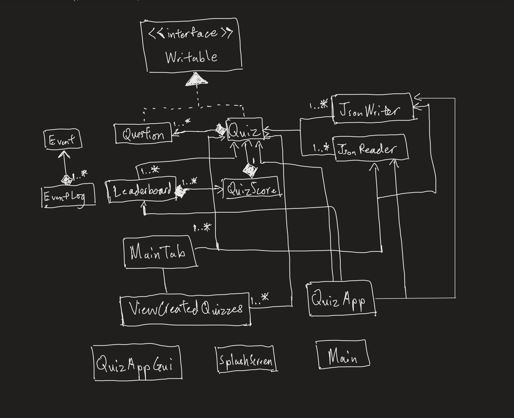

# My Personal Project

## Project Title: Quiz Game

### ***Project Proposal***:
- **What will the application do?**
 As the name suggests, this application will allow users to create and play 
quizzes on various topics. Users can design the different difficulties of the quiz 
and questions that come in different format, such as multiple choice, fill in the 
blanks, short answers and such. Users will be able to know how well they did 
on the quiz as the application has a scoring system that keeps track of their performance.
- **Who will use it?**
 The target audience of this application are individuals who are interested in 
*taking or making quizzes* and willing to challenge themselves. It can be used by educators, 
students or anyone looking for an interactive game that will put their knowledge and creativity
to test.
- **Why is this project of interest of you?**
 I want to challenge myself to make a simple game and I think this application fits
perfectly as it combines elements of game development and an educational software. 

### ***User Stories***:
- As a user, I want to be able to create a new quiz to the list of quizzes in the application.
- As a user, I want to be able to play the quiz I created.
- As a user, I want to be able to view the list of quizzes I have created.
- As a user, I want to be able to receive immediate feedback on whether my answer is correct
or not as I play the quiz.
- As a user, I want my scores to be added to a leaderboard after I complete a quiz.
- As a user, I want to be able to view the leaderboard to know my improvement
from the previous runs.
- As a user, I want to save my created quiz to file(if I so choose).
- As a user, I want to load my created quiz from file(if I so choose)

### ***Instructions for Grader***:
- Click the button labelled "Add Quiz" to add quiz to quiz list.
- Click the button labelled "View Quizzes" to view the quizzes created.
- Click the button labelled "Remove" in the "View Quizzes" panel to remove an existing quiz.
- Click the button labelled "Play Quiz" to play the quiz created.
- You can find the image in the main panel and when you are playing the quiz.
- Click the "File" dropdown menu and click "Save" to save the file.
- Click the "File" dropdown menu and click "Load" to load the file.

### ***Phase 4: Task 2***:
- Fri Dec 01 03:10:51 PST 2023
- New quiz added to quiz list: quiz1
- Fri Dec 01 03:10:51 PST 2023
- Answer choice 1 added: 1
- Fri Dec 01 03:10:51 PST 2023
- Answer choice 2 added: 2
- Fri Dec 01 03:10:51 PST 2023
- Answer choice 3 added: 3
- Fri Dec 01 03:10:51 PST 2023
- Answer choice 4 added: 4
- Fri Dec 01 03:10:51 PST 2023
- Correct answer added at index: 2
- Fri Dec 01 03:10:51 PST 2023
- Question added to quiz1: 1+1
- Fri Dec 01 03:10:51 PST 2023
- Answer choice 1 added: 1
- Fri Dec 01 03:10:51 PST 2023
- Answer choice 2 added: 2
- Fri Dec 01 03:10:51 PST 2023
- Answer choice 3 added: 3
- Fri Dec 01 03:10:51 PST 2023
- Answer choice 4 added: 4
- Fri Dec 01 03:10:51 PST 2023
- Correct answer added at index: 1
- Fri Dec 01 03:10:51 PST 2023
- Question added to quiz1: 1x1
- Fri Dec 01 03:10:51 PST 2023
- File loaded from: ./data/quiz.json
- Fri Dec 01 03:10:53 PST 2023
- Viewed created quizzes
- Fri Dec 01 03:10:57 PST 2023
- File saved to: ./data/quiz.json
- Process finished with exit code 0

### ***Phase 4: Task 3***:

I think my diagram is way too complex as there are way too many associations which makes the diagram harder
to understand. Some classes are taking too many responsibilities which led to high coupling.
- If I had more time to work on my project, I would refactor my code so that I would distribute the responsibilities
among classes to avoid excessive associations and avoid introducing high coupling. For example, in my main tab class,
I would refactor each the component that makes up my gui such as Button, Panel, and the Button logic into their own
classes through a main class which they have a bidirectional relationship with. This is so that the program has more 
cohesion that allows them to update each other.
- I can create a controller class whose purpose is to implement the logic for play quiz, create quiz, save file, load
file, etc instead of packing them all into one class like what I did in the MainTab class. This would improve code 
readability, as well as facilitating easier maintenance and potential adding of more features to my application. My UML 
diagram would then also look much cleaner with less associations from one single class to multiple classes.

